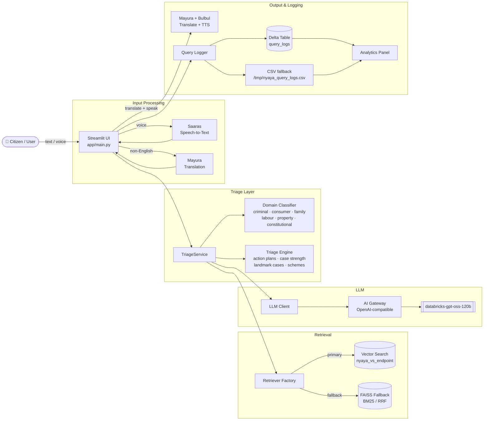

# Nyaya-Saathi

Nyaya-Saathi is a multilingual legal first-response assistant for Indian citizens. It uses Databricks-hosted LLM and retrieval infrastructure to convert a user situation into grounded legal guidance, practical next steps, and cited references.

## Architecture Diagram



## Repo Structure

- `app/main.py`: Streamlit entrypoint and UI flow.
- `app.yaml`: Databricks Apps runtime command and default env.
- `src/nyaya_dhwani/triage_service.py`: orchestration for retrieval + LLM + follow-up handling.
- `src/nyaya_dhwani/triage_engine.py`: context assembly, clarifying question flow, citation formatting.
- `src/nyaya_dhwani/retrievers/`: FAISS, hybrid, and Databricks Vector Search retrievers.
- `src/nyaya_dhwani/llm_client.py`: Databricks AI Gateway/OpenAI-compatible chat completions client.
- `src/nyaya_dhwani/sarvam_client.py`: translation, STT, TTS integrations.
- `src/nyaya_dhwani/query_logger.py`: Delta/CSV analytics logging.
- `notebooks/`: ingestion/indexing/evaluation notebooks used to prepare legal corpus and benchmarks.

## Prerequisites (Databricks)

- Databricks workspace with Apps + Vector Search enabled.
- Databricks CLI installed locally.
- A public GitHub repo URL for this project.
- Sarvam API key.
- Databricks AI Gateway route/model available for your workspace.

## Required Databricks Permissions

The Databricks App runs as its own identity (service principal). Grant the following before deployment.

### A) AI Gateway / Model serving permissions

- Resource: the AI Gateway route or serving endpoint used by LLM_OPENAI_BASE_URL.
- Required permission: CAN_QUERY.
- Why: the app calls chat completions for answer generation.

### B) Vector Search permissions (primary retriever)

- Resource: Vector Search endpoint nyaya_vs_endpoint.
- Required permission: Can Use.
- Resource: Unity Catalog objects backing the index.
- Required permissions:
  - USE CATALOG on workspace
  - USE SCHEMA on workspace.default
  - SELECT on workspace.default.legal_rag_corpus_index
- Why: VectorSearchRetriever calls query_index against workspace.default.legal_rag_corpus_index.

### C) UC Volume permissions (FAISS fallback)

- Resource: /Volumes/workspace/default/bharat_bricks_hacks/nyaya_index
- Required permission: READ FILES on the volume path.
- Why: fallback retriever downloads/loads manifest.json, corpus.faiss, and chunks.parquet.

### D) Secret scope permissions (Sarvam key)

- Resource: secret scope nyaya-dhwani and key sarvam_api_key.
- Required permission: READ.
- Why: app/main.py loads SARVAM_API_KEY from Databricks secret scope at startup.

## Build & Run On Databricks

### 1) Configure Databricks CLI access

```bash
export DATABRICKS_HOST="https://<your-workspace>.cloud.databricks.com"
databricks auth login --host "$DATABRICKS_HOST" --profile nyaya
export DATABRICKS_CONFIG_PROFILE="nyaya"
databricks current-user me
```

### 2) Create secret scope and store Sarvam key

```bash
databricks secrets create-scope nyaya-dhwani
databricks secrets put-secret nyaya-dhwani sarvam_api_key --string-value "<your-sarvam-api-key>"
```

If the scope already exists, run only the second command.

### 3) Create Databricks Repo from your public GitHub repository

```bash
databricks repos create \
  --url "https://github.com/<owner>/<repo>.git" \
  --provider gitHub \
  --path "/Workspace/Repos/<your-username>/bharat-bricks-hacks"
```

### 4) Build corpus/index in Databricks (one-time setup)

Run these notebooks in order from the Databricks workspace:

1. `notebooks/india_legal_policy_ingest.ipynb`
2. `notebooks/build_rag_index.ipynb`
3. `notebooks/setup_vector_search.ipynb` (if Vector Search endpoint/index are not already provisioned)

Expected retrieval configuration used by the app:

```text
NYAYA_RETRIEVAL_BACKEND=vector_search
NYAYA_VS_ENDPOINT_NAME=nyaya_vs_endpoint
NYAYA_VS_INDEX_NAME=workspace.default.legal_rag_corpus_index
NYAYA_USE_HYBRID=true
```

### Retrieval configuration details

The app supports three retrieval behaviors controlled by environment variables:

1. Vector Search primary + FAISS fallback
  - Set NYAYA_RETRIEVAL_BACKEND=vector_search
  - Set NYAYA_VS_ENDPOINT_NAME and NYAYA_VS_INDEX_NAME
  - Behavior: tries Databricks Vector Search first; on failure/empty result falls back to FAISS.

2. Hybrid FAISS mode
  - Set NYAYA_RETRIEVAL_BACKEND=faiss
  - Set NYAYA_USE_HYBRID=true
  - Behavior: FAISS dense retrieval plus BM25/RRF fusion and cross-reference expansion.

3. Plain FAISS mode
  - Set NYAYA_RETRIEVAL_BACKEND=faiss
  - Set NYAYA_USE_HYBRID=false
  - Behavior: semantic FAISS retrieval with keyword boosting.

FAISS index path resolution:

- NYAYA_INDEX_DIR defaults to /Volumes/workspace/default/bharat_bricks_hacks/nyaya_index
- If this is a /Volumes path and direct file access is unavailable in App runtime, the code downloads artifacts to /tmp/nyaya_index via Databricks SDK.

### Environment variable reference

Set these in Databricks App environment configuration (app.yaml and/or App UI env vars).

| Variable | Required | Example | Purpose |
|---|---|---|---|
| LLM_OPENAI_BASE_URL | Yes | https://<workspace-id>.ai-gateway.cloud.databricks.com/mlflow/v1 | Base URL for OpenAI-compatible Databricks chat completions |
| LLM_MODEL | Yes | databricks-gpt-oss-120b | Model route name used for generation |
| DATABRICKS_TOKEN | Usually No in Apps | dapi... | Local/dev token fallback; Apps commonly use OAuth identity via SDK |
| LLM_CHAT_COMPLETIONS_URL | Optional | https://.../chat/completions | Full URL override (takes precedence over base URL) |
| NYAYA_RETRIEVAL_BACKEND | Yes | vector_search | Select retriever backend |
| NYAYA_VS_ENDPOINT_NAME | Required for vector_search | nyaya_vs_endpoint | Vector Search endpoint name |
| NYAYA_VS_INDEX_NAME | Required for vector_search | workspace.default.legal_rag_corpus_index | Vector Search index name |
| NYAYA_USE_HYBRID | Optional | true | Enable HybridRetriever in FAISS mode |
| NYAYA_INDEX_DIR | Recommended | /Volumes/workspace/default/bharat_bricks_hacks/nyaya_index | FAISS index location |
| NYAYA_CATALOG | Optional | workspace | Catalog for logging table |
| NYAYA_SCHEMA | Optional | default | Schema for logging table |
| NYAYA_LOG_TABLE | Optional | workspace.default.query_logs | Analytics read table in sidebar |
| NYAYA_LOG_CSV | Optional | /tmp/nyaya_query_logs.csv | CSV fallback log path |
| SARVAM_API_KEY | Required for translation/voice | <secret> | Enables translation, STT, TTS |
| SARVAM_STT_MODE | Optional | translate | Voice behavior: translate to English transcript or transcribe |
| SARVAM_STT_MODEL | Optional | saaras:v3 | STT model |
| SARVAM_TTS_MODEL | Optional | bulbul:v3 | TTS model |
| LOG_LEVEL | Optional | INFO | Application logging verbosity |

### 5) Deploy as Databricks App

Use Databricks UI:

1. Compute -> Apps -> Create app
2. Select the repo path created above
3. Deploy

Runtime command is already defined in `app.yaml`:

```yaml
command: ["python", "app/main.py"]
```

### 6) (Optional) Local smoke test

```bash
python3 -m venv .venv
source .venv/bin/activate
python -m pip install --upgrade pip
pip install -r requirements.txt
python app/main.py
```

### 7) (Optional) Run tests

```bash
pytest -q
```

## Demo Steps (What To Click / What Prompt To Run)

1. Open your Databricks App URL from Compute -> Apps.
2. In sidebar, set **Language** to `Hindi · हिन्दी` (or any supported language).
3. In sidebar, under **Quick start prompt**, select `Domestic violence`.
4. Click **Ask quick prompt**.
5. Verify that the assistant returns legal guidance (and translated output for non-English sessions).
6. Toggle **Read answer aloud** ON to hear TTS output.
7. Open **Usage analytics** expander in sidebar.
8. Click **Refresh analytics** and verify query/domain/latency entries.
9. In chat input box, run this prompt:

```text
My landlord is trying to evict me illegally without notice. What should I do first and what documents should I keep?
```

10. (Optional voice demo) In sidebar **Voice**, record audio and click **Send voice**.

## Key Features

- The app is designed to be grounded and non-fabricating: retrieval citations + deterministic action-plan context are injected before LLM generation.
- Retrieval has resilience: Vector Search primary, FAISS/hybrid fallback.
- Query analytics are persisted to Delta on Databricks when Spark is available, with local CSV fallback.
- In Databricks Apps deployment, runtime command is defined in `app.yaml` as `python app/main.py`.

## License

MIT (see `LICENSE`).
