# Nyaya Dhwani

Multilingual legal information assistant for Indian law. Ask questions about the Bharatiya Nyaya Sanhita (BNS), IPC mappings, and related statutes in 13 languages with citations.

Built on Databricks Free Edition with FAISS RAG, GPT-5.4-mini (AI Gateway), and Sarvam AI (translation, speech-to-text, text-to-speech), delivered as a Streamlit Databricks App.

Not legal advice. General information only.

## Architecture diagram

```mermaid
flowchart LR
  U["User (text or voice)"] -->|Speech| STT["Sarvam Saaras STT"]
  U -->|Text| IN["User text"]
  STT --> IN
  IN --> T1["Sarvam Mayura translate to English"]
  T1 --> RET["FAISS semantic search"]
  RET --> CTX["Top-k legal chunks"]
  CTX --> LLM["Databricks GPT-5.4-mini"]
  LLM --> OUT["Answer with citations"]
  OUT --> T2["Sarvam Mayura translate back"]
  T2 --> UI["Streamlit UI + sources"]
  UI -->|Optional| TTS["Sarvam Bulbul TTS"]
```



## What it does

The app answers legal questions in a chosen Indian language, retrieves relevant BNS/Act text via FAISS RAG, and returns a bilingual response with citations. Voice input/output is supported via Sarvam STT/TTS.

## Workflow summary

1. User speaks or types a question in any supported language.
2. Sarvam Mayura translates the question to English.
3. FAISS retrieves top-k legal text chunks.
4. GPT-5.4-mini generates a grounded answer with citations.
5. Sarvam Mayura translates the answer back to the chosen language.
6. Streamlit shows bilingual answer plus sources and can read it aloud.

Supported languages: English, Hindi, Bengali, Kannada, Tamil, Telugu, Malayalam, Marathi, Gujarati, Odia, Punjabi, Assamese, Urdu.

## How to run (exact commands)

### Databricks (recommended)

```bash
# 1) Authenticate
databricks auth login --host https://dbc-6651e87a-25a5.cloud.databricks.com --profile free-aws
export DATABRICKS_CONFIG_PROFILE=free-aws

# 2) Create secret scope and add keys
databricks secrets create-scope nyaya-dhwani
databricks secrets put-secret nyaya-dhwani sarvam_api_key
databricks secrets put-secret nyaya-dhwani hf_token

# 3) Run ingestion and index build notebooks on a Databricks cluster
#    - notebooks/india_legal_policy_ingest.ipynb
#    - notebooks/build_rag_index.ipynb

# 4) Deploy the app (Databricks UI)
#    Compute -> Apps -> Create -> Connect this Git repo -> Deploy

# 5) Grant app service principal permissions
#    - CAN_QUERY on AI Gateway endpoint
#    - READ on UC Volume main.india_legal.legal_files
#    - READ on secret scope nyaya-dhwani
```

### Local development

```bash
pip install -e ".[dev,rag,rag_embed,app]"
cp .env.example .env
export $(grep -v '^#' .env | xargs)
python app/main.py
```

## Demo steps (clicks and prompts)

1. Open the Streamlit app URL.
2. Choose a language in the sidebar (e.g., Hindi or Tamil).
3. Click the microphone icon and speak, or type a prompt.
4. Example prompt to run:

```text
My phone was stolen on the street yesterday. I have CCTV footage. What should I do and which law applies?
```

5. Observe the bilingual answer and citations. Click the speaker icon to hear the response.

## Repository layout

| Path | Purpose |
|------|---------|
| [app/main.py](app/main.py) | Streamlit chat app (RAG + LLM + Sarvam multilingual) |
| [app.yaml](app.yaml) | Databricks Apps entry point + env config |
| [src/nyaya_dhwani/](src/nyaya_dhwani/) | Core package: retrieval, LLM client, Sarvam clients, triage | 
| [notebooks/](notebooks/) | Data ingestion and FAISS index build |
| [requirements.txt](requirements.txt) | App dependencies |
| [tests/](tests/) | pytest suite |
| [docs/](docs/) | Documentation |


## Testing

```bash
pip install -e ".[dev,rag]"
pytest tests/ -v
```

## Technology stack

| Component | Technology |
|-----------|-----------|
| LLM | Databricks GPT-5.4-mini (AI Gateway) |
| Embeddings | sentence-transformers/all-MiniLM-L6-v2 |
| Vector search | FAISS (IndexFlatIP, cosine similarity) |
| Translation | Sarvam Mayura |
| Speech-to-text | Sarvam Saaras |
| Text-to-speech | Sarvam Bulbul |
| App framework | Streamlit on Databricks Apps |
| Data platform | Databricks (Unity Catalog, Volumes, Apps) |
